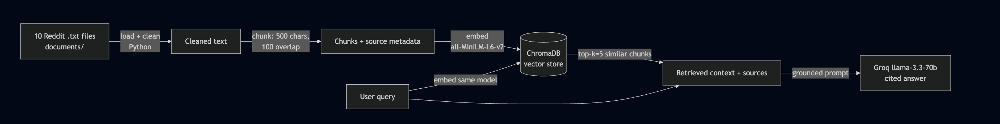

# Project 1 Planning: The Unofficial Guide

> Write this document before you write any pipeline code.
> Your spec and architecture diagram are what you'll use to direct AI tools (Claude, Copilot, etc.) to generate your implementation — the more specific they are, the more useful the generated code will be.
> Update the Retrieval Approach and Chunking Strategy sections if you change your approach during implementation.
> Update this file before starting any stretch features.

---

## Domain - The Hayward Commuter & Lifestyle Matrix

<!-- What domain did you choose? Why is this knowledge valuable and hard to find through official channels? -->

## The Hayward Commuter & Lifestyle Matrix captures the hyper-local survival tactics for California State University, East Bay students, focusing on off-campus living, transit optimization, and local dining. This knowledge is vital because official university guides don't reflect the daily realities of commuting up the hill via public transit, navigating competitive housing, or identifying the best student-approved spots to eat and study between classes.

## Documents

<!-- List your specific sources: URLs, subreddit names, forum threads, or file descriptions.
     Aim for at least 10 sources that together cover different subtopics or perspectives within your domain. -->

| #   | Source | Description                                                                                      | URL or location                                                                                  |
| --- | ------ | ------------------------------------------------------------------------------------------------ | ------------------------------------------------------------------------------------------------ | --------------------------------------------------------------------------------------------------- |
| 1   | Reddit | Students debating the cost of gas vs. the time it takes to use the campus shuttle and AC transit | https://www.reddit.com/r/bayarea/comments/19dvftz/better_to_bart_or_to_drive/                    |
| 2   | Reddit | How's commuting by BART to CSUEB?                                                                | https://www.reddit.com/r/CSUEB/comments/1ppuyb1/hows_commuting_by_bart/                          |
| 3   | Reddit | The Hayward BART Shuttle Experience                                                              | https://www.reddit.com/r/CSUEB/comments/15zewmy/hayward_bart_shuttle/                            |
| 4   | Reddit | Commuting from Surrounding Cities                                                                | https://www.reddit.com/r/eastbay/comments/1orv92m/transferring_for_school/                       |
| 5   | Reddit | What's it actually like living near campus?                                                      |                                                                                                  | https://www.reddit.com/r/CSUEB/comments/1qbocxu/for_students_that_live_near_campus_whats_it_like/   |
| 6   | Reddit | Honest Reviews of CSUEB Housing & Dorms                                                          | https://www.reddit.com/r/CSUEB/comments/1gjhjcl/housing/                                         |
| 7   | Reddit | Honest Opinion about CSUEB Campus Life                                                           | https://www.reddit.com/r/CSUEB/comments/1t1c8ky/what_is_your_honest_opinion_about_csueb/         |
| 8   | Reddit | Vegetarian-Friendly Family Restaurants in East Bay                                               |                                                                                                  | https://www.reddit.com/r/eastbay/comments/1thgd6b/best_smaller_familyowned_vegetarianfriendly_type/ |
| 9   | Reddit | The Best Vegetarian Spots in the Bay Area                                                        | https://www.reddit.com/r/bayarea/comments/1qv3nyo/what_are_the_very_best_vegetarianfriendly_bay/ |
| 10  | Reddit | Favorite Vegan/Vegetarian Eats Around Town                                                       | https://www.reddit.com/r/eastbay/comments/1b9atub/favorite_veganvegetarian_eats/                 |

---

## Chunking Strategy

<!-- How will you split documents into chunks?
     State your chunk size (in tokens or characters), overlap size, and explain why those
     numbers fit the structure of your documents.
     A review-heavy corpus warrants different chunking than a long FAQ. -->

**Chunk size:**
500 characters

**Overlap:**
100 characters

**Reasoning:**
Since the source documents are Reddit threads and forum discussions, the text consists of short, highly opinionated comments rather than long-form academic paragraphs. A 500-character chunk is long enough to capture a complete review without diluting the specific entity being discussed. The 100-character overlap acts as a safety net; if a user mentions "Carlos Bee" at the end of one chunk, the overlap ensures the next chunk retains that subject context so the LLM knows what the subsequent pronouns ("they", "it") refer to.

---

## Retrieval Approach

<!-- Which embedding model are you using (e.g., all-MiniLM-L6-v2 via sentence-transformers)?
     How many chunks will you retrieve per query (top-k)?
     If you were deploying this for real users and cost wasn't a constraint, what tradeoffs
     would you weigh in choosing a different embedding model — context length, multilingual
     support, accuracy on domain-specific text, latency? -->

**Embedding model:** all-MiniLM-L6-v2 via sentence-transformers running locally

**Top-k:** 5 chunks per query

**Production tradeoff reflection:**
If deploying this for thousands of users without budget constraints, I would evaluate upgrading to a model with a larger context window and better handling of slang/acronyms (like OpenAI's text-embedding-3-large or Voyage AI). all-MiniLM is fast and free, but it can struggle with highly informal internet text. I would also weigh the latency of running embeddings locally versus hitting an API, as local inference on a production server can become a bottleneck during high traffic.

---

## Evaluation Plan

<!-- List your 5 test questions with their expected correct answers.
     Questions should be specific enough that you can judge whether the system's response
     is right or wrong. "What are good dining halls?" is too vague.
     "What do students say about wait times at [dining hall name] during lunch?" is testable. -->

| #   | Question                                                                                    | Expected answer                                                                                         |
| --- | ------------------------------------------------------------------------------------------- | ------------------------------------------------------------------------------------------------------- |
| 1   | Which bus line is best for getting from Hayward BART to campus, and what is its main issue? | AC Transit Line 60, though it is frequently delayed during morning peak hours.                          |
| 2   | What is the most effective way to pay for the AC transit bus up the hill?                   | Using a contactless credit card or transit card directly on the bus, rather than buying single tickets. |
| 3   | Is the campus shuttle free for CSUEB students?                                              | Yes, free for students                                                                                  |
| 4   | Which nearby cities do students recommend for affordable housing?                           | Hayward, Union City (east of 880), San Leandro; avoid going north                                       |
| 5   | What vegetarian restaurant in Hayward do students recommend?                                | Veggie Lee (vegan Chinese)                                                                              |

---

## Anticipated Challenges

<!-- What could go wrong? Name at least two specific risks with reasoning.
     Consider: noisy or inconsistent documents, missing source attribution, off-topic
     retrieval, chunks that split key information across boundaries. -->

1.Every file has Upvote/Downvote/Reply/Share, promoted ads, and even Redact spam ("squeal dependent subsequent pet..."). If cleaning misses these, chunks fill with junk tokens and retrieval degrades.

2.Reddit threads inherently contain conflicting opinions. One chunk might say "Carlos Bee is great for the price," and another might say "Avoid Carlos Bee at all costs." The LLM might struggle to synthesize a grounded answer when the retrieved context directly contradicts itself.

---

## Architecture

<!-- Draw a diagram of your pipeline showing the five stages:
     Document Ingestion → Chunking → Embedding + Vector Store → Retrieval → Generation
     Label each stage with the tool or library you're using.
     You can use ASCII art, a Mermaid diagram, or embed a sketch as an image.
     You'll use this diagram as context when prompting AI tools to implement each stage. -->

---

## AI Tool Plan

<!-- For each part of the pipeline below, describe:
     - Which AI tool you plan to use (Claude, Copilot, ChatGPT, etc.)
     - What you'll give it as input (which sections of this planning.md, which requirements)
     - What you expect it to produce
     - How you'll verify the output matches your spec

     "I'll use AI to help me code" is not a plan.
     "I'll give Claude my Chunking Strategy section and ask it to implement chunk_text()
     with my specified chunk size and overlap" is a plan. -->

**Milestone 3 — Ingestion and chunking:**
I will provide the raw text structure of a Reddit thread to the AI and ask it to write a Python function that uses regex to strip out timestamps, usernames, and upvote counts, leaving only the comment text

**Milestone 4 — Embedding and retrieval:**
I will prompt the AI with my "Chunking Strategy" section to implement a precise 500-character split with a 100-character overlap, ensuring it doesn't split words in half

**Milestone 5 — Generation and interface:**
I will give the AI my pipeline diagram and the Gradio skeleton provided in the assignment, asking it to wire up the Groq llama-3.3-70b-versatile API call to force the LLM to answer only from the retrieved context
